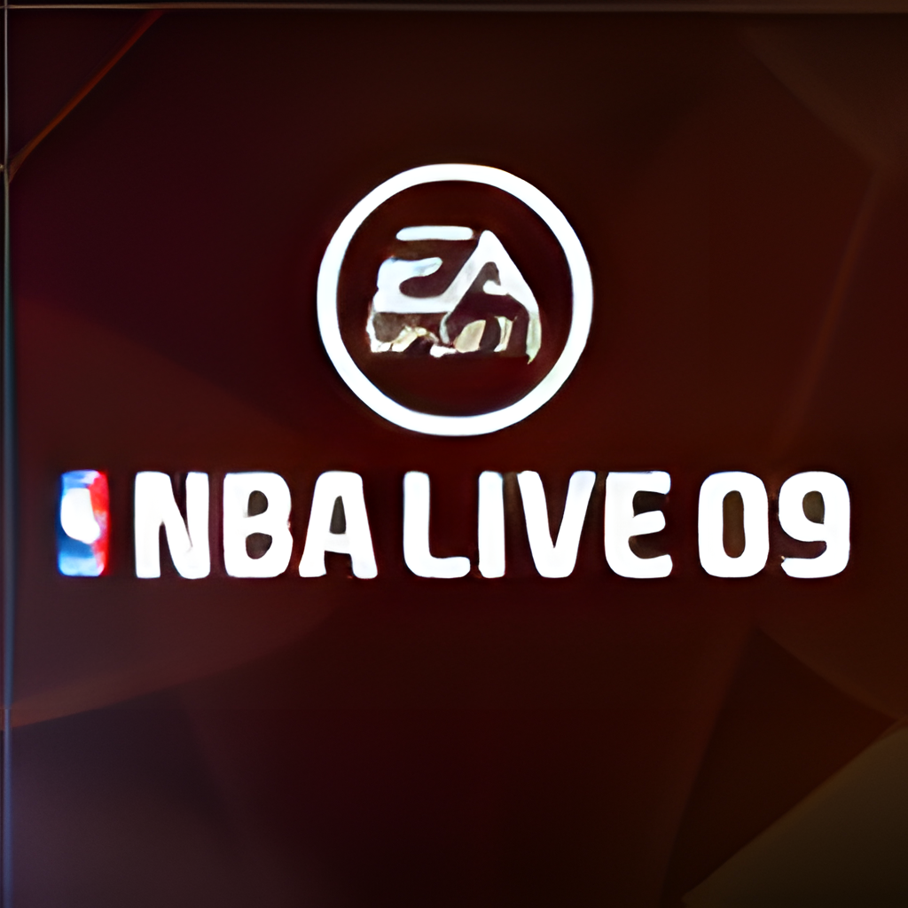

<p align="center">
  
</p>

<h1 align="center">NBA LIVE 09</h1>

<p align="center">
  Native PC static recompilation of the Xbox 360 version, built on the
  <a href="../README.md">liveRecomped</a> framework and ReXGlue.
</p>

## Game

| | |
| --- | --- |
| Developer | EA Canada |
| Publisher | Electronic Arts (EA SPORTS) |
| Series | NBA LIVE |
| Platform recompiled | Xbox 360 |
| Released | 7 Oct 2008 (NA), 9 Oct 2008 (AU), 10 Oct 2008 (EU) |
| Genre | Sports, basketball |
| Modes | Single-player, local multiplayer, online (servers offline) |
| Cover athlete | Tony Parker |
| Rating | ESRB Everyone |
| Achievements | 23, 1000 Gamerscore |

## Regions

| Region | Serial | Status |
| --- | --- | --- |
| 🇪🇺 Europe | `EA-2170` | ✅ Tested (the disc below) |
| 🇺🇸 USA | `EA-2170` | ⬜ Not tested |
| 🇯🇵 Japan | `EA-2170` | ⬜ Not tested |
| 🌏 Asia | `EA-2170` | ⬜ Not tested |

Only the tested disc's `default.xex` has been recompiled. Other regional
executables are likely to differ and may need their own codegen pass.
Region list from [Redump](http://redump.org/discs/system/xbox360/).

## Disc

| | |
| --- | --- |
| Region | 🇪🇺 Europe |
| Title ID | `4541087A` |
| Media ID | `6653832E` |
| Executable version | 0.0.0.2 (built 2008-08-18) |
| Contents | 56 files, 6,545,424,081 bytes |
| Audio languages | English, French, Spanish |
| DLL modules | None |
| Video format | EA VP6 (`movies\*.vp6` in `data4.big`) |

## Status

| Area | State |
| --- | --- |
| Boot, EA intro videos | Working |
| Menus, profiles, favourite team | Working |
| Practice shootaround, pause and resume | Working |
| Play Now matches | Working |
| Audio | Working |
| Controllers | Working (Xbox, PlayStation, Switch through SDL) |
| DLC | Installer in place (see the [root README](../README.md#dlc)); no packages tested |
| Xbox PC app (GDK sideload) | Launches and plays |
| UWP build (Xbox Developer Mode) | Builds, installs and reaches setup on Windows; untested on console |
| Online modes | Unavailable |
| Unlocked framerate | Not supported; game and cutscene speed are tied to 60 Hz |
| Ultrawide | Not supported; renders 16:9 with letterboxing |
| Linux, macOS, Steam Deck | Builds expected, not play-tested |

## Play

1. Download `NBALIVE09-v<version>-windows-x64.zip` from
   [Releases](https://github.com/furqanagwan/liveRecomped/releases?q=LIVE09)
   and extract it to a folder you can write to.
2. Run `NBA LIVE 09.exe` and choose your Xbox 360 ISO (European disc, see
   [Regions](#regions)); the files are copied once.
3. Open the system menu with **View + Menu** (or **Esc**) for Settings and Exit.

## System requirements

| | Required |
| --- | --- |
| OS | Windows 10 version 2004 (build 19041) or Windows 11, 64-bit |
| Processor | 64-bit x86 CPU with SSE4.1 |
| Graphics | DirectX 12 GPU (feature level 11_0) |
| Memory | 8 GB RAM recommended |
| Storage | 6.5 GB, plus room for the ISO while it is copied |
| Software | [Microsoft Visual C++ Redistributable 2015-2022 (x64)](https://aka.ms/vs/17/release/vc_redist.x64.exe) |
| Game | Your own NBA LIVE 09 (Europe) Xbox 360 disc image |

Tested on an Intel Core Ultra 9 275HX, GeForce RTX 5080 Laptop GPU and 32 GB RAM
(Windows 11).

## Build from source

```
rexglue extract "<your disc>.iso" LIVE09\assets
.\framework\scripts\build.ps1 -Game LIVE09
```

Setup is described in [CONTRIBUTING.md](../CONTRIBUTING.md).

## Xbox Developer Mode (UWP)

Xbox Developer Mode only runs UWP apps, so this game also has a UWP build. It
uses the UWP flavour of the ReXGlue SDK installed at `C:\ReXGlue-UWP`: a
CoreWindow window, XAudio2 audio and XInput, with SDL removed.

1. Build: `.\framework\scripts\build.ps1 -Game LIVE09 -Preset win-amd64-uwp-release`
2. Test on Windows: `.\framework\scripts\package_uwp.ps1 -Game LIVE09 -Register`, then launch
   NBA LIVE 09 from Start. Allow file system access for it under
   Settings > Privacy & security > File system so it can read your ISO.
3. Package for Xbox: `.\framework\scripts\package_uwp.ps1 -Game LIVE09 -Pack` writes a signed
   `.msix` and `Dependencies\x64\Microsoft.VCLibs.x64.14.00.appx` to
   `out\uwp`. In Device Portal choose Add, upload both, then set the app to
   **Game** in Dev Home so it gets the 5 GB game memory budget.

To build the UWP SDK itself, from `framework/thirdparty/rexglue-sdk` in a Visual
Studio developer shell:

```
cmake --preset win-amd64-uwp -DCMAKE_INSTALL_PREFIX=C:/ReXGlue-UWP
cmake --build --preset win-amd64-uwp-release
cmake --install out/build/win-amd64-uwp --config Release
```

## Default settings

`settings/nba_live_09.toml` is copied next to the executable. Settings saved in
the in-game menu override it.

| Setting | Value | Reason |
| --- | --- | --- |
| `render_target_path_d3d12` | `rov` | Host render targets turn the practice court black after pausing |
| `render_target_path_vulkan` | `fsi` | Vulkan equivalent of the above |
| `d3d12_pipeline_creation_threads` | `0` | Background pipeline creation corrupted the heap on match start |
| `async_shader_compilation` | `false` | Same as above |
| `vsync`, `video_mode_refresh_rate` | `true`, `60` | Gameplay speed is frame-locked |
| `gpu_allow_invalid_fetch_constants` | `true` | Silences thousands of harmless texture warnings |
| `recomp_shared_controllers` | `true` | Every controller drives player 1 |

## Recompilation notes

| | |
| --- | --- |
| Generated sources | 497 files, about 257 MB |
| Function seeds | 429 active in `config/functions.toml` |
| Disabled seeds | 58 in `config/disabled_function_seeds.txt` (they split real functions) |
| Kernel stubs | `XUsbcamGetState`, `XUsbcamSetConfig` (Xbox Live Vision camera), shared from `framework/common/src/kernel` |
| Known codegen warnings | 26 unhandled `vpkd3d128` float16 packs, one 1.36 MB function |

SDK fixes required by this game, carried on the ReXGlue fork:

- `vpkuwus` / `vpkuhus` read aliased sources before writing, fixing green VP6 video
- `InputSystem` entry points are serialized, fixing a controller-polling crash

The full investigation log, including every crash and how it was fixed, is in
[docs/NOTES.md](docs/NOTES.md).

## Folder contents

| Path | Purpose |
| --- | --- |
| `src/nba_live_09_app.h` | Game descriptor |
| `release.json` | Supported disc and system requirements for release packaging |
| `config/` | Codegen overrides and function seeds |
| `settings/` | Runtime defaults |
| `gdk/MicrosoftGame.config` | Xbox PC app package metadata |
| `resources/nba_live_09.rc` | Windows icon and version information |
| `assets/` | Your extracted game files (not committed) |
| `generated/` | Recompiled C++ (not committed) |
| `docs/icon.png` | HD title icon shown above |
| `metadata/` | Artwork extracted from your disc (not committed) |

## Artwork

`docs/icon.png` is the 64x64 title image inside `default.xex`, upscaled to
1024x1024. The exe icon, Xbox PC app tiles and splash screen are generated
locally from it:

1. `rexglue init --project-name nba_live_09 --xex-path assets\default.xex achievements assets\default.xex metadata`
2. Upscale `metadata/icons/title.png` (Real-ESRGAN `realesrgan-x4plus`, 4x twice)
   to `metadata/gdk_hd/title_1024.png`, or copy `docs/icon.png` there.
3. `.\framework\scripts\generate_artwork.ps1 -Game LIVE09 -ProjectName nba_live_09`
   writes the exe icon and the Xbox app images.

## Legal

Not affiliated with or endorsed by Electronic Arts or Microsoft. NBA LIVE and
EA SPORTS are trademarks of Electronic Arts. You must own the game.
