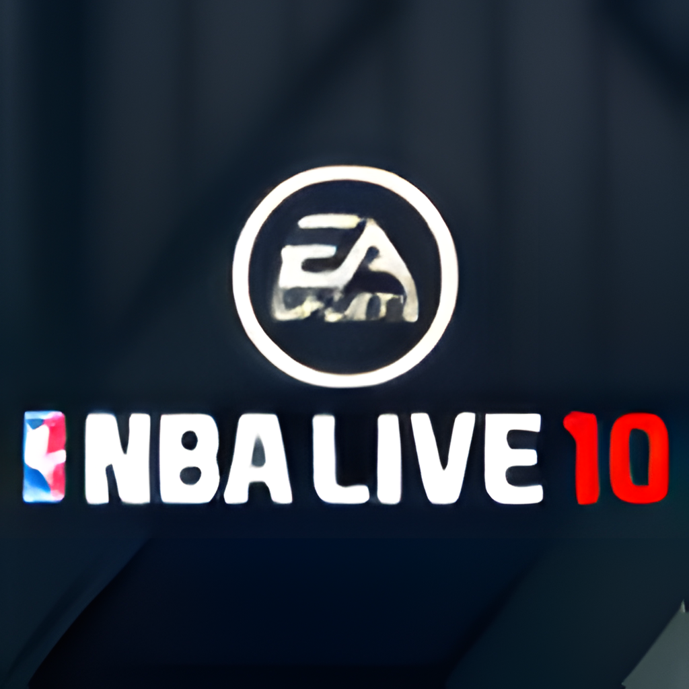

<p align="center">
  
</p>

<h1 align="center">NBA LIVE 10</h1>

<p align="center">
  Native PC static recompilation of the Xbox 360 version, built on the
  <a href="../README.md">liveRecomped</a> framework and ReXGlue.
</p>

## Game

| | |
| --- | --- |
| Developer | EA Canada |
| Publisher | Electronic Arts (EA SPORTS) |
| Series | NBA LIVE |
| Platform recompiled | Xbox 360 |
| Released | October 2009 |
| Genre | Sports, basketball |
| Modes | Single-player, local multiplayer, online (servers offline) |
| Achievements | 33, 1000 Gamerscore |

## Regions

| Region | Serial | Status |
| --- | --- | --- |
| 🇪🇺 🌏 Europe, Asia | `EA-2241` | ✅ Tested (the disc below) |
| 🇺🇸 USA | `EA-2241` | ⬜ Not tested |
| 🇯🇵 Japan | `EA-2241` | ⬜ Not tested |

Only the tested disc's `default.xex` has been recompiled. Other regional
executables are likely to differ and may need their own codegen pass.
Region list from [Redump](http://redump.org/discs/system/xbox360/).

## Disc

| | |
| --- | --- |
| Region | 🇪🇺 🌏 Europe, Asia |
| Title ID | `454108C1` |
| Contents | 64 files, 6,267,027,825 bytes |
| Executable | `default.xex`, 20,299,776 bytes |
| Audio languages | English, French, Spanish |
| Archives | `data1.big` to `data7.big` |
| DLL modules | None |

## Status

| Area | State |
| --- | --- |
| Boot, menus | Working |
| Profile creation and loading | Working (needed the SDK 64-bit argument fix) |
| Music | Plays, but sometimes stops; under investigation |
| Controllers | Working through SDL |
| DLC | Installer in place (see the [root README](../README.md#dlc)); no packages tested |
| Matches | Not yet tested |
| Xbox PC app, UWP builds | Configured, not yet tested |
| Linux, macOS, Steam Deck | Builds expected, not play-tested |

## Play

1. Download `NBALIVE10-v<version>-windows-x64.zip` from
   [Releases](https://github.com/furqanagwan/liveRecomped/releases?q=LIVE10)
   and extract it to a folder you can write to.
2. Run `NBA LIVE 10.exe` and choose your Xbox 360 ISO (Europe/Asia disc, see
   [Regions](#regions)); the files are copied once.
3. Open the system menu with **View + Menu** (or **Esc**) for Settings and Exit.

While the music issue is open, start the game with extra logging so a failure
can be diagnosed:

```powershell
& ".\NBA LIVE 10.exe" --log_level=debug
```

## System requirements

| | Required |
| --- | --- |
| OS | Windows 10 version 2004 (build 19041) or Windows 11, 64-bit |
| Processor | 64-bit x86 CPU with SSE4.1 |
| Graphics | DirectX 12 GPU (feature level 11_0) |
| Memory | 8 GB RAM recommended |
| Storage | 6.5 GB, plus room for the ISO while it is copied |
| Software | [Microsoft Visual C++ Redistributable 2015-2022 (x64)](https://aka.ms/vs/17/release/vc_redist.x64.exe) |
| Game | Your own NBA LIVE 10 (Europe, Asia) Xbox 360 disc image |

Tested on an Intel Core Ultra 9 275HX, GeForce RTX 5080 Laptop GPU and 32 GB RAM
(Windows 11).

## Build from source

```
rexglue extract "<your disc>.iso" LIVE10\assets
.\framework\scripts\build.ps1 -Game LIVE10
```

Setup is described in [CONTRIBUTING.md](../CONTRIBUTING.md).

## Default settings

`settings/nba_live_10.toml` starts from the NBA LIVE 09 settings, which fixed a
black screen after pausing (`rov` / `fsi` render target paths) and heap
corruption at match start (no background pipeline creation). Whether LIVE 10
needs them has not been tested separately.

## Recompilation notes

| | |
| --- | --- |
| Generated sources | 570 files, about 291 MB |
| Function seeds | 836 in `config/functions.toml` |
| Disabled seeds | 19 in `config/disabled_function_seeds.txt` (they split real functions) |
| Kernel stubs | Xbox Live Vision camera, shared from `framework/common/src/kernel` |
| Known codegen warnings | 26 unhandled `vpkd3d128` float16 packs, one 1.36 MB function |

The full log of what was found and fixed is in [docs/NOTES.md](docs/NOTES.md).

## Xbox Developer Mode (UWP)

Same flow as NBA LIVE 09, using `uwp/AppxManifest.xml`:

```powershell
.\framework\scripts\build.ps1 -Game LIVE10 -Preset win-amd64-uwp-release
.\framework\scripts\package_uwp.ps1 -Game LIVE10 -Register
.\framework\scripts\package_uwp.ps1 -Game LIVE10 -Pack
```

## Artwork

`docs/icon.png` is the title image from `default.xex`, upscaled to 1024x1024.
To regenerate the exe icon and Xbox app images locally:

1. Extract achievements and the title image:
   `rexglue init --project-name nba_live_10 --xex-path assets\default.xex achievements assets\default.xex metadata`
2. Upscale `metadata/icons/title.png` 4x twice with Real-ESRGAN
   (`realesrgan-x4plus`) to `metadata/gdk_hd/title_1024.png`, or copy
   `docs/icon.png` there.
3. `.\framework\scripts\generate_artwork.ps1 -Game LIVE10 -ProjectName nba_live_10`
   writes the exe icon and the Xbox app images.

## Legal

Not affiliated with or endorsed by Electronic Arts or Microsoft. NBA LIVE and
EA SPORTS are trademarks of Electronic Arts. You must own the game.
